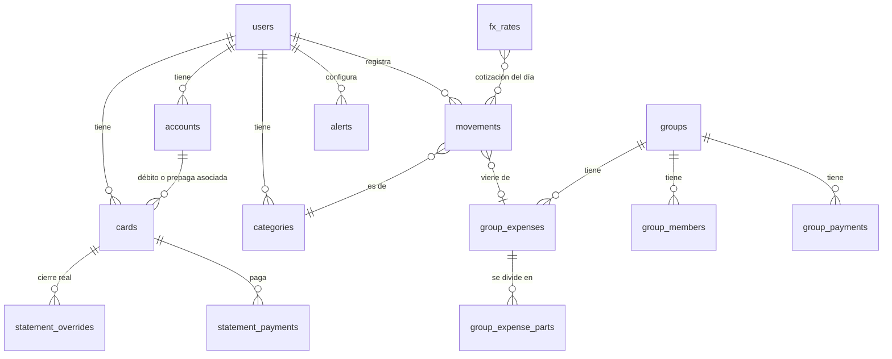

# Modelo de datos

**Fuente de verdad** del modelo de datos desde el 1 de octubre de 2026, junto con [02-reglas-de-negocio.md](02-reglas-de-negocio.md). Para cambiar una tabla o una regla, primero se cambia acá.

**Backend:** Supabase (Postgres, autenticación por mail con código, políticas por fila, pg_cron y Edge Functions en TypeScript). La decisión y sus motivos están en [decisiones/2026-10-01-eng-review.md](decisiones/2026-10-01-eng-review.md), y los diagramas y tests, en [05-plan-tecnico.md](05-plan-tecnico.md).

## Criterios

- **Montos:** `numeric(14,2)` en la base, nunca `float`. Cada monto va con su moneda (`ARS` | `USD`). En el código (`packages/core`), el dinero es `Money = { minor: entero (centavos), currency }`, y se convierte en el borde con la base. Toda conversión de moneda pasa por `convert()`, que redondea al centavo con half-up.
- **Restos:** las cuotas y las partes de un gasto de grupo siempre suman el total exacto. El resto va a la primera cuota o al que pagó (02 §3 y §7).
- **Identificadores de gastos:** los genera el teléfono (UUID) y el servidor guarda con `insert … on conflict (id) do nothing`, así un reintento nunca duplica.
- **Día:** toda fecha "del día" se calcula en hora `America/Argentina/Buenos_Aires`.
- **Cotización por movimiento:** cada movimiento guarda la cotización que corresponda de su día (ver [02-reglas-de-negocio.md](02-reglas-de-negocio.md) §1).
- **Lo que se calcula no se guarda:** cuotas por resumen, estado de un resumen, saldos de grupo y gasto por categoría se calculan a partir de los movimientos. Se guarda solo lo que el usuario decide: pagos, ajustes y cierres corregidos.
- **Borrado lógico** (`deleted_at`) en cuentas, grupos y gastos de grupo.
- **Tarjetas archivadas:** `archived_at`. Un proceso diario borra definitivamente las tarjetas archivadas hace más de 7 días, con sus consumos y pagos.
- **Esquema:** `supabase/migrations/20261002120000_schema_v1.sql` (T5, 2/10). Los valores de los tipos van en inglés (`bank`, `card_due`…), salvo `mep`, `oficial` y `blue`. Las cotizaciones son `numeric(14,4)`.
- **Seguridad por fila:**
  - Cada tabla personal tiene la política `user_id = auth.uid()`.
  - Nadie referencia filas de otro usuario o de otro grupo adivinando un UUID: FK compuestas `(user_id, id)` en cuentas y tarjetas, y `(group_id, id)` en integrantes y gastos de grupo. Lo que una FK no cubre (categoría, `group_expense_id`, la tarjeta de un aviso) lo valida un trigger.
  - Permisos por columna: lo que solo cambia una función (`deleted_at`, `owner_member_id`, `invite_token_hash`, `currency` del grupo, `user_id` y `left_at` de un integrante) no tiene grant de update.
  - Las tablas personales tienen delete (el "Deshacer" borra). Las de grupo no.
  - Los gastos de grupo y sus partes se escriben solo con `save_group_expense`; directo, solo el borrado lógico (`deleted_at`). Así nadie guarda partes que no suman el total llamando a la API.
  - En los grupos, cada integrante ve el grupo entero mediante `is_group_member(group_id)` (ver Funciones de la base).
  - El rol anónimo no lee ninguna tabla: la web de invitados entra solo por `get_guest_group(token)`.
  - La clave `service_role` se usa solo en las Edge Functions, nunca en la app.
- **Fuera de la v1:** las tablas y columnas de funciones recortadas (`budgets`, `cards.kind` débito o prepaga, `receipt_path`, alertas de precio y de presupuesto) pueden existir, pero la beta no las usa.

## Diagrama

## Tablas

### `users` y `user_settings`
| Campo | Tipo | Notas |
|---|---|---|
| id | uuid | |
| name, email | text | |
| display_currency | ARS/USD | Moneda en que se ve el inicio |
| fx_reference | mep/oficial/blue | Dólar de referencia |
| theme | system/light/dark | |
| notify_push | bool | |
| quiet_from, quiet_to | smallint | Horario de "no molestar" |
| goal | control/save/invest | Elegido en la bienvenida |

En la base es `user_settings`, con `user_id` → `auth.users` (nombre y mail viven en `auth.users`). Se crea sola al registrarse. Avisos por mail y WhatsApp y el resumen semanal quedan fuera de la v1.

### `accounts`
| Campo | Tipo | Notas |
|---|---|---|
| id, user_id | uuid | |
| name | text | "Caja de ahorro Galicia" |
| type | bank/wallet/cash | |
| currency | ARS/USD | Una sola por cuenta |
| opening_balance | numeric | El saldo actual se calcula |

### `cards` (crédito, débito y prepagas en una tabla)
| Campo | Tipo | Notas |
|---|---|---|
| id, user_id | uuid | |
| kind | credit/debit/prepaid | |
| bank | text | "Banco Galicia" |
| name | text | Nombre que le da el usuario |
| network | VISA/MC/AMEX/CABAL | |
| last4 | char(4) | Nunca el número completo |
| expiry | char(5) | MM/AA |
| color | text | |
| is_favorite | bool | Máximo una por usuario (índice único parcial) |
| account_id | uuid | Solo débito y prepaga |
| close_day, due_day | smallint | Solo crédito, 1 a 31 (en meses cortos, el último día) |
| credit_limit | numeric | Solo crédito, en pesos |
| archived_at | timestamptz | Al "eliminar"; se borra definitivamente a los 7 días |

### `statement_overrides`
Fecha real de cierre y vencimiento de un resumen, cuando el banco la corre. **Validación** (eng review, 1/10): el cierre corregido tiene que quedar a ±10 días del estimado, después del cierre anterior y antes del siguiente.
| card_id | period (año-mes) | close_date | due_date |

### `statement_payments`
Puede haber **varios pagos por resumen** (pagos parciales). Cada fila es un pago desde una cuenta.
| Campo | Tipo | Notas |
|---|---|---|
| id, card_id | uuid | |
| period | date (1.º del mes de cierre) | Qué resumen se pagó |
| applies_to | ARS/USD | Qué parte del resumen cubre |
| amount | numeric | Monto que cubre, en la moneda de `applies_to` |
| from_account_id | uuid | De dónde salió la plata; ahí vuelve si se deshace |
| debited_amount | numeric | Lo que se descontó de la cuenta, en su moneda |
| fx_card_rate | numeric | Dólar tarjeta usado si se pagaron dólares en pesos |
| paid_at | timestamptz | |
| reverted_at | timestamptz | Al deshacer: el pago deja de contar y se genera el reintegro a la cuenta |

Saldo pendiente de un resumen = total del resumen − Σ pagos no revertidos (por moneda).

### `movements` (gastos, ingresos, transferencias y ajustes)
| Campo | Tipo | Notas |
|---|---|---|
| user_id | uuid | |
| id | uuid | Lo genera el teléfono; el servidor guarda con upsert |
| type | expense/income/transfer/adjustment/card_payment | `card_payment`: pago de una tarjeta purgada, convertido en movimiento de la cuenta |
| origin | manual/text/claim/purge | Cómo se creó. `claim`: vino de reclamar un lugar en un grupo |
| date | date | Fecha de la compra |
| description | text | |
| amount | numeric | Monto total |
| currency | ARS/USD | |
| card_id | uuid | Si se pagó con tarjeta de crédito |
| account_id | uuid | Si se pagó con débito, billetera o efectivo (o es la cuenta afectada) |
| to_account_id | uuid | Transferencias y compra de dólares. En una transferencia, `amount` y `currency` son lo que **entra** a esta cuenta y `debited_amount` lo que **sale** de `account_id`, en su moneda (spec de core, 2/10). *Ejemplo: comprás US$ 100 pagando $142.000 → `amount` US$ 100, `debited_amount` $142.000.* |
| installments | smallint | 1 por defecto; solo con tarjeta de crédito. De 1 a 24 (`check`, revisión del 2/10) |
| category_id | uuid | |
| my_share | numeric | Si viene de un grupo: tu parte, en la moneda del movimiento |
| group_expense_id | uuid | Vínculo con el gasto de grupo |
| fx_mep, fx_oficial, fx_blue | numeric | Cotizaciones del día; las completa un trigger de la base según la fecha del gasto, en hora de Argentina (eng review, 1/10) |
| fx_pending | bool | Falta alguna cotización de esa fecha; `ingest_fx_rates` la completa cuando llega |
| fx_estimated | bool | La cotización salió de fuera de la ventana de 4 días (la tarea diaria resolvió un pendiente de más de 2 días): hay que revisarla (ajuste de T6, 4/10) |
| debited_amount | numeric | Si la moneda del gasto difiere de la cuenta: lo descontado, en la moneda de la cuenta (eng review, 1/10) |
| receipt_path | text | Imagen del comprobante *(fuera de la v1, fase 2)* |
| created_at, updated_at | timestamptz | |

Restricción: o `card_id` o `account_id`, nunca los dos ni ninguno. Hay dos excepciones: los ajustes y los gastos con `origin = claim` que todavía no tienen medio de pago ("Sin medio de pago", 02 §7).

Índice: `movements(user_id, card_id, date)`.

Un gasto "cargado tarde" no tiene columna: se calcula comparando su fecha con el último cierre que ya pasó (02 §3).

### `categories` y `budgets`
| categories | id, user_id, name, icon, color, sort, is_system ("Otros") |
|---|---|
| **budgets** *(fuera de la v1)* | category_id, monthly_amount_ars (opcional) |

En la beta hay 6 categorías fijas (`is_system`), del sistema (`user_id` nulo) y compartidas por todos, con UUID fijos: `00000000-0000-4000-8000-000000000001` Supermercado, `…02` Salidas, `…03` Transporte, `…04` Servicios, `…05` Suscripciones y `…06` Otros. Un gasto de grupo solo usa categorías del sistema. También existe `category_keywords` (user_id, word, category_id), donde se guardan las correcciones de categoría que hace cada usuario (02 §5). Es única por (user_id, word): si la misma palabra se corrige a otra categoría, se pisa y gana la última corrección. Las palabras de la lista que no enseña (02 §5) nunca se guardan.

### `fx_rates`
Cotizaciones que guarda el backend.
| source (dolarapi, argentinadatos) | kind (mep, oficial, blue, tarjeta, ccl, cripto) | buy | sell | fetched_at | rate_date |

- **`fetched_at`** es la hora que informa la fuente, no la del cron: el sábado DolarApi sigue devolviendo la del viernes. El historial de ArgentinaDatos se guarda a las 23:59:59 de Argentina de su fecha, así el cierre le gana a las del día.
- **`rate_date`** se genera con el día de `fetched_at` en hora de Argentina. Hay un único por (source, kind, fetched_at), así que la misma respuesta dos veces no duplica.
- **Cron** (pg_cron, T6, migración `20261002150000_fx_rates.sql`):
  - `fx-rates` cada 10 minutos, que llama a la Edge Function del mismo nombre (DolarApi);
  - `fx-history` a las 6:00 UTC (3:00 en Argentina), que trae los últimos 30 días de ArgentinaDatos.
  - Los dos pasan por `private.call_edge`, que lee `functions_url` y `fx_cron_secret` de Vault; si falta alguno, no hace nada. Las Edge Functions solo traen el JSON y llaman a `ingest_fx_rates`.
- **Casas:** `bolsa` es `mep` y `contadoconliqui` es `ccl`; `mayorista` y `solidario` no se guardan.
- **Trigger `movements_fx`** (`before insert or update`): completa `fx_mep`, `fx_oficial` y `fx_blue` con la venta de la fecha del gasto (02 §1).
  - Se calcula al crear, al cambiar la fecha y mientras el movimiento esté pendiente. En cualquier otra edición conserva lo guardado, y lo que mande la app se pisa.
  - Sin cotización en los 4 días hasta la fecha, la que falta queda nula y `fx_pending = true`.
  - **Tarea diaria `fx-resolve-stale`** (7:00 UTC, 4:00 en Argentina, una hora después del historial): `private.resolve_stale_fx` resuelve los pendientes cuya fecha tiene más de 2 días con la última venta anterior, sin límite de días, o con la primera del historial si la fecha es anterior a todo. Esos movimientos quedan con `fx_estimated = true`. Solo esa tarea estima: cargar o editar desde la app nunca lo hace, y la app no puede cambiar la marca. Si después se cambia la fecha, se recalcula con la ventana normal y la marca se borra.

### `groups`, `group_members`
| groups | id, name, currency, owner_member_id (pasa al azar a otro integrante con cuenta si el dueño se va; puede quedar nulo), invite_token_hash (SHA-256 en hex de un token aleatorio de 128 bits; reemplaza a `invite_code`), invite_token_created_at, deleted_at |
|---|---|
| **group_members** | id, group_id, user_id (nulo si es provisorio), display_name, payment_alias (alias o CBU para saldar; **nunca** sale en la web de invitados), joined_at, left_at, claimed_at (cuándo se reclamó el lugar; habilita deshacer durante 7 días), unclaimed_at, unclaimed_by (quién deshizo el reclamo y cuándo) |

Índices: `group_members(user_id, group_id)` y `group_expenses(group_id, date)`.

### `group_expenses`, `group_expense_parts`
| group_expenses | id, group_id, date, description, amount, currency, fx_rate (fija), payer_member_id, split_mode (equal/exact; pct y shares en la fase 2), category_id, created_by, updated_at y updated_by (los completa un trigger al editar; cuando una FK los pone en nulo porque se borró una cuenta, no cuenta como edición), deleted_at |
|---|---|
| **group_expense_parts** | group_id, group_expense_id, member_id, value (1 en partes iguales; monto, % o partes según el modo) |

### `group_payments`
| id | group_id | from_member_id | to_member_id | amount (moneda del grupo) | date | created_by | deleted_at, voided_by |

Un pago nunca se edita: si estaba mal, cualquier integrante lo **anula** (`void_group_payment`, guarda `deleted_at` y `voided_by`) y se registra de nuevo. Los saldos y la web de invitados ignoran los anulados.

### `private.job_failures`
Lo que una tarea diaria no pudo hacer, para revisarlo: id, job, ref_id, error, failed_at. La app no la ve (T7).

### `alerts` y `notifications`
| alerts | id, user_id, type (en la v1: `card_closing`/`card_due`; precio, presupuesto, grupo y semanal después), enabled, params jsonb. Uno por tarjeta y tipo; solo push en la v1 |
|---|---|
| **notifications** | id, user_id, alert_id, title, body, severity, created_at, sent_at, read_at |

Ejemplos de `params` según el tipo:
- **precio:** `{asset:"mep", op:">", value:1600}`
- **vencimiento:** `{card_id, days_before:2}`. De 1 a 5, configurable por tarjeta; sale a las 10:00, hora de Argentina (02 §9)
- **presupuesto:** `{category_id, pct:80}`

## Funciones de la base

| Función | Qué hace |
|---|---|
| `is_group_member(group_id)` | Security definer y stable, con `search_path` fijo. Devuelve true si el usuario actual es integrante activo (`left_at` nulo) de un grupo no eliminado. La usan todas las políticas de grupo. Solo `authenticated` |
| `get_guest_group(token)` | Security definer. Compara el SHA-256 del token y devuelve nombre, moneda, integrantes (`id`, `display_name`, `has_account`, `active`), gastos no borrados con sus partes y pagos, **sin** `payment_alias`, `user_id` ni `created_by`. Los montos van como texto. Los saldos los calcula la web con `groupBalances` de core. Es la única función que ejecuta el rol anónimo. No muestra los pagos anulados |
| `create_group(group_name, group_currency, member_name)` | Security definer. Con sesión iniciada: crea el grupo y el lugar de quien lo crea, y lo deja como dueño |
| `leave_group(group_id)` | Salir estando al día (umbral por moneda, calculado con `private.group_balances`). Si es el dueño, llama a `transfer_ownership`. Es la única forma de escribir `left_at` |
| `claim_member(token, member_id)` | Con sesión iniciada y el token vigente: asigna `user_id` a un integrante provisorio y activo, guarda `claimed_at`, crea un movimiento `origin = claim` "Sin medio de pago" por cada gasto no borrado que pagó ese lugar (con su categoría y `my_share` = su parte en la moneda del gasto) y avisa a los integrantes con cuenta. Falla si quien reclama ya es integrante activo del grupo |
| `void_group_payment(payment_id)` | Cualquier integrante anula un pago. Anular uno ya anulado no hace nada |
| `save_group_expense(expense_id, group_id, expense_date, description, amount, currency, fx_rate, payer_member_id, split_mode, category_id, parts)` | Crea o edita (mismo `expense_id`) un gasto con sus partes en una transacción. `parts` es `[{"member_id", "value"}]`. Valida: al menos una persona; sin repetidos; en exactos, partes ≥ 0 en la moneda del gasto que suman el total con tolerancia de $0,50 (se guardan como se cargaron; la diferencia va al que pagó al calcular); `fx_rate` solo si la moneda difiere de la del grupo; pagador y partes del grupo y activos, salvo los que el gasto ya tenía. Un gasto borrado no se edita |
| `remove_member(member_id)` | Solo el dueño, y solo a alguien que nunca participó en un gasto ni en un pago (aunque estén borrados o anulados) y está al día. Borra la fila y le avisa si tenía cuenta. El dueño no se quita a sí mismo |
| `delete_group(group_id)` | Solo el dueño (sin dueño no se puede eliminar). Borrado lógico, revoca el link, pone en nulo `group_expense_id` y `my_share` en los movimientos de todos que venían del grupo (vuelven a contar completos) y avisa a los integrantes |
| `rotate_invite_token(group_id)` / `revoke_invite_token(group_id)` | Integrantes con cuenta. `rotate` genera un token de 128 bits en base64url, guarda su SHA-256 y lo devuelve una sola vez; el link anterior deja de andar. `revoke` lo borra |
| `undo_claim(member_id)` | Solo el dueño o quien reclamó, dentro de los 7 días. **Solo corta el vínculo** (revisión del 2/10, R3-8 y R3-9): pone `user_id` en nulo, así el lugar vuelve a ser provisorio con el mismo nombre; los gastos y pagos del grupo no cambian. Borra los movimientos de esa cuenta con `origin = claim` de ese grupo, porque eran del integrante provisorio. En los demás movimientos de esa cuenta que venían del grupo pone `group_expense_id` en nulo, así pasan a contar completos. No borra nada más de la cuenta. Borra el `payment_alias` (es de la persona, no del lugar). Guarda `unclaimed_at` y `unclaimed_by` y avisa a la persona desvinculada, salvo que lo haya deshecho ella. Si el lugar era el dueño, llama a `transfer_ownership` |
| `private.transfer_ownership(group_id, leaving_member)` | Interna. Al irse el dueño: elige al azar otro integrante activo con `user_id` y avisa a todos; si no hay ninguno, deja el dueño en nulo |
| `private.purge_archived_cards()` | *(T7)* Cron `purge-archived-cards` a las 6:30 UTC (3:30 en Argentina). Para cada tarjeta con `archived_at` de hace 7 días o más, en su propio bloque: cada pago no revertido pasa a ser un movimiento `card_payment` (`origin = purge`) de `from_account_id` por `debited_amount`, en la moneda de la cuenta, con la fecha de `paid_at` en hora de Argentina y la descripción "Pago de tarjeta Visa ··2337 (eliminada)"; después borra sus alertas (no tienen FK) y la tarjeta, y la cascada se lleva consumos, cierres corregidos y pagos. El saldo de las cuentas no cambia (T-19). Si una tarjeta falla, `raise warning` y una fila en `private.job_failures`; las demás siguen. Devuelve cuántas purgó |
| `delete_account()` | *(T10)* Solo `authenticated` y con login reciente: el claim `amr` del JWT tiene que tener un método `otp` o `password` con `timestamp` de menos de 10 minutos (no se usa `iat`, que se renueva en cada refresh); si no, `42501` "reauthentication required". Si era dueño de un grupo no eliminado, llama a `transfer_ownership` aunque tenga saldo (sin heredero, el grupo queda sin dueño). Pone `payment_alias` y `claimed_at` en nulo en sus lugares y borra el usuario de `auth.users`: la cascada borra todo lo personal y las FK `set null` dejan el lugar provisorio con el mismo nombre. Los gastos, partes y pagos de grupo no se tocan, así los saldos de los demás no cambian (T-26) |
| `private.member_shares` / `private.group_balances` | Internas. Copia en SQL de `shares` y `groupBalances` de core, en centavos, para "al día" y `my_share`. Tienen que dar lo mismo que core: los tests de `supabase/tests/05_group_balances.test.sql` usan los mismos ejemplos. Si cambia la regla en core, cambia acá |
| `export_account()` | *(T10)* Solo `authenticated`. JSON con `version`, `exported_at`, `user` (id, email y ajustes), cuentas, tarjetas, cierres corregidos, pagos de tarjeta, movimientos, palabras, alertas, avisos y grupos. Montos como texto y sin `user_id` en las filas. Grupos activos: como los ve en la app (`private.group_snapshot`, lo mismo que la web de invitados) más su lugar con su alias; grupos que dejó o eliminados: solo el nombre y su lugar. Nunca trae alias ni `user_id` de los demás |
| `private.group_snapshot(gid)` | Interna. El grupo como lo ve un integrante: nombre, moneda, integrantes (`id`, `display_name`, `has_account`, `active`), gastos no borrados con partes y pagos no anulados. La usan `get_guest_group` y `export_account` |
| `ingest_fx_rates(source, payload)` | Solo `service_role` (la llaman las Edge Functions `fx-rates` y `fx-history`). `source` es `dolarapi` o `argentinadatos` (si no, `22023`) y `payload` es la lista que devolvió la API. Mapea las casas, saltea las filas que no se pueden leer (venta nula, ≤ 0 o en texto, fecha inválida), no duplica, y después vuelve a calcular los movimientos con `fx_pending`. Devuelve cuántas filas nuevas guardó |
| `fx_rate_on(kind, date)` | Solo `authenticated`. La venta de un tipo en una fecha, con la misma ventana de 4 días que el trigger, o nulo. La app la usa con `tarjeta` para proponer `debited_amount` y los pagos de dólares en pesos (02 §2 y §3). Un tipo desconocido da `22023` |
| `private.fx_sell_fallback(kind, date)` / `private.resolve_stale_fx()` | Internas, de la tarea diaria: la última venta anterior sin límite (o la primera del historial) y la resolución de los pendientes de más de 2 días |
| `private.fx_sell_on(kind, date)` | Interna. La venta más reciente entre `date − 4` y `date` (por `rate_date` y después `fetched_at`), o nulo. Cubre fines de semana y feriados puente |
| `private.call_edge(fn)` | Interna. La usan los cron: `POST` con `pg_net` a `functions_url/fn` con `Authorization: Bearer fx_cron_secret`, los dos de Vault |

## Cálculos (`packages/core`)

Firmas implementadas en la épica del 2/10 ([spec](specs/2026-10-02-epica-core.md)). Montos con `Money` (centavos enteros), cotizaciones con `Rate` (string decimal), fechas `'YYYY-MM-DD'` y resúmenes `'YYYY-MM'` (mes de cierre).

| Función | Entrada | Salida |
|---|---|---|
| `convert(money, rate, to)` | monto, cotización en pesos por dólar, moneda destino | monto convertido, half-up al centavo alejándose del cero. Única vía de conversión (D8) |
| `fromDbNumeric(s, currency)` / `toDbNumeric(money)` | `numeric(14,2)` como string / `Money` | conversión exacta en el borde con la base |
| `closeDate` / `dueDate(card, period, overrides)` | tarjeta, resumen, cierres corregidos | fecha de cierre y de vencimiento (días 29 a 31 ajustados, D11; si el vencimiento ajustado no queda después del cierre, vence al día siguiente) |
| `validateCardDays(closeDay, dueDay)` | días configurados | ok si en todos los meses el vencimiento queda al menos 5 días después del cierre, y el mínimo de días |
| `statementFor(card, date, overrides)` | tarjeta, fecha de compra, cierres corregidos | resumen en el que entra; usa el cierre real si existe |
| `validateOverride(card, period, override, overrides)` | corrección propuesta | ok, o el motivo del rechazo (±10 días y entre los cierres vecinos, D10) |
| `installmentSchedule(card, expense, overrides)` | gasto con cuotas | cuota, resumen y monto de cada una; el resto va a la primera (D9) |
| `cardState({card, expenses, payments, overrides, today, fxCard})` | tarjeta, consumos, pagos, hoy, dólar tarjeta | resúmenes con estado, total, pagado, pendiente y excedente; "A pagar"; pendiente total por moneda (`pendingTotal`); límite usado y disponible |
| `lateExpenseImpact({card, expense, expenses, payments, overrides, today, fxCard})` | gasto que se está cargando | si es tarde, si hay que preguntar "¿Ya lo pagaste?" y los pagos propuestos (R3-3, R3-4) |
| `shares(group, expense)` | gasto de grupo | parte de cada incluido en la moneda del grupo, con el resto al que pagó |
| `groupBalances(group, expenses, payments)` | gastos y pagos del grupo | saldo exacto por integrante; suman cero |
| `displayBalance(money)` / `isSettled(money)` | saldo | cero si está debajo del umbral de su moneda (D14) / si el integrante está "al día" (02 §7) |
| `simplifyDebts(group, balances)` | saldos | transferencias, como máximo N−1: pagan solo los que no están al día, a todos los que tienen saldo a favor |
| `accountBalance(account, movements, payments)` | cuenta, movimientos, pagos de tarjeta | saldo actual |
| `categorySpend({movements, cards, month, reference, todayRate})` | movimientos y tarjetas | gasto por categoría en pesos: tu parte; con tarjeta, cada cuota en el mes de cierre de su resumen |
| `netWorth({display, referenceRate, fxCard, accountBalances, myGroupBalances, cardDebts})` | saldos ya calculados; `cardDebts` = `pendingTotal` de cada tarjeta | cuentas, grupos, tarjetas y total en pesos o en dólares, cada componente convertido una sola vez (02 §8) |

- Son funciones en **TypeScript puro, sin dependencias ni acceso a la base**: reciben filas y devuelven resultados con `Money`.
- Las usan la app (incluso sin conexión) y las Edge Functions (aviso de cierre y vencimientos), así que los números siempre coinciden.
- Se testean con Vitest; los ejemplos de [02-reglas-de-negocio.md](02-reglas-de-negocio.md) son los primeros tests (matriz completa en [05-plan-tecnico.md](05-plan-tecnico.md)).
- `groupBalances` devuelve los saldos exactos. El umbral de cero por moneda lo aplican `displayBalance`, `isSettled` y `simplifyDebts`; la base usa el mismo umbral para abandonar, quitar a un integrante y eliminar el grupo.
