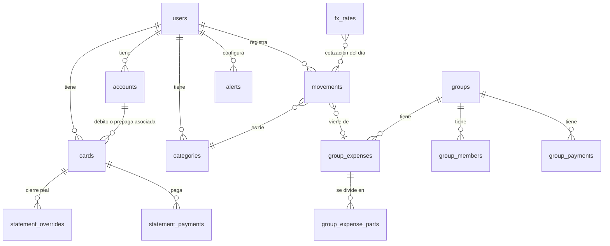

# Modelo de datos

**Fuente de verdad** del modelo de datos desde el 1 de octubre de 2026, junto con [02-reglas-de-negocio.md](02-reglas-de-negocio.md). Para cambiar una tabla o una regla, primero se cambia acá.

**Backend:** Supabase (Postgres, autenticación por mail con código, políticas por fila, pg_cron y Edge Functions en TypeScript). La decisión y sus motivos están en [decisiones/2026-10-01-eng-review.md](decisiones/2026-10-01-eng-review.md), y los diagramas y tests, en [05-plan-tecnico.md](05-plan-tecnico.md).

## Criterios

- **Montos:** `numeric(14,2)` en la base, nunca `float`. Cada monto va con su moneda (`ARS` | `USD`). En el código (`packages/core`), el dinero es `Money = { minor: entero (centavos), currency }`, y se convierte en el borde con la base. Toda conversión de moneda pasa por `convert()`, que redondea al centavo con half-up.
- **Restos:** las cuotas y las partes de un gasto de grupo siempre suman el total exacto. El resto va a la primera cuota o al que pagó (02 §3 y §7).
- **Identificadores de gastos:** los genera el teléfono (UUID) y el servidor guarda con `insert … on conflict (id) do nothing`, así un reintento nunca duplica.
- **Día:** toda fecha "del día" se calcula en hora `America/Argentina/Buenos_Aires`.
- **Cotización por movimiento:** cada movimiento guarda la cotización que corresponda de su día (ver [02-reglas-de-negocio.md](02-reglas-de-negocio.md) §1).
- **Lo que se calcula no se guarda:** cuotas por resumen, estado de un resumen, saldos de grupo y gasto por categoría se calculan a partir de los movimientos. Se guarda solo lo que el usuario decide: pagos, ajustes y cierres corregidos.
- **Borrado lógico** (`deleted_at`) en cuentas, grupos y gastos de grupo.
- **Tarjetas archivadas:** `archived_at`. Un proceso diario borra definitivamente las tarjetas archivadas hace más de 7 días, con sus consumos y pagos.
- **Seguridad por fila:**
  - Cada tabla personal tiene la política `user_id = auth.uid()`.
  - En los grupos, cada integrante ve el grupo entero mediante `is_group_member(group_id)` (ver Funciones de la base).
  - El rol anónimo no lee ninguna tabla: la web de invitados entra solo por `get_guest_group(token)`.
  - La clave `service_role` se usa solo en las Edge Functions, nunca en la app.
- **Fuera de la v1:** las tablas y columnas de funciones recortadas (`budgets`, `cards.kind` débito o prepaga, `receipt_path`, alertas de precio y de presupuesto) pueden existir, pero la beta no las usa.

## Diagrama

## Tablas

### `users` y `user_settings`
| Campo | Tipo | Notas |
|---|---|---|
| id | uuid | |
| name, email | text | |
| display_currency | ARS/USD | Moneda en que se ve el inicio |
| fx_reference | mep/oficial/blue | Dólar de referencia |
| theme | system/light/dark | |
| notify_push, notify_mail, notify_whatsapp | bool | |
| whatsapp_number | text | Pro |
| quiet_from, quiet_to | smallint | Horario de "no molestar" |
| weekly_summary | bool | |
| goal | control/ahorro/invertir | Elegido en la bienvenida |

### `accounts`
| Campo | Tipo | Notas |
|---|---|---|
| id, user_id | uuid | |
| name | text | "Caja de ahorro Galicia" |
| type | banco/billetera/efectivo | |
| currency | ARS/USD | Una sola por cuenta |
| opening_balance | numeric | El saldo actual se calcula |

### `cards` (crédito, débito y prepagas en una tabla)
| Campo | Tipo | Notas |
|---|---|---|
| id, user_id | uuid | |
| kind | credit/debit/prepaid | |
| bank | text | "Banco Galicia" |
| name | text | Nombre que le da el usuario |
| network | VISA/MC/AMEX/CABAL | |
| last4 | char(4) | Nunca el número completo |
| expiry | char(5) | MM/AA |
| color | text | |
| is_favorite | bool | Máximo una por usuario (índice único parcial) |
| account_id | uuid | Solo débito y prepaga |
| close_day, due_day | smallint | Solo crédito, 1 a 31 (en meses cortos, el último día) |
| credit_limit | numeric | Solo crédito, en pesos |
| archived_at | timestamptz | Al "eliminar"; se borra definitivamente a los 7 días |

### `statement_overrides`
Fecha real de cierre y vencimiento de un resumen, cuando el banco la corre. **Validación** (eng review, 1/10): el cierre corregido tiene que quedar a ±10 días del estimado, después del cierre anterior y antes del siguiente.
| card_id | period (año-mes) | close_date | due_date |

### `statement_payments`
Puede haber **varios pagos por resumen** (pagos parciales). Cada fila es un pago desde una cuenta.
| Campo | Tipo | Notas |
|---|---|---|
| id, card_id | uuid | |
| period | date (1.º del mes de cierre) | Qué resumen se pagó |
| applies_to | ARS/USD | Qué parte del resumen cubre |
| amount | numeric | Monto que cubre, en la moneda de `applies_to` |
| from_account_id | uuid | De dónde salió la plata; ahí vuelve si se deshace |
| debited_amount | numeric | Lo que se descontó de la cuenta, en su moneda |
| fx_card_rate | numeric | Dólar tarjeta usado si se pagaron dólares en pesos |
| paid_at | timestamptz | |
| reverted_at | timestamptz | Al deshacer: el pago deja de contar y se genera el reintegro a la cuenta |

Saldo pendiente de un resumen = total del resumen − Σ pagos no revertidos (por moneda).

### `movements` (gastos, ingresos, transferencias y ajustes)
| Campo | Tipo | Notas |
|---|---|---|
| user_id | uuid | |
| id | uuid | Lo genera el teléfono; el servidor guarda con upsert |
| type | expense/income/transfer/adjustment/card_payment | `card_payment`: pago de una tarjeta purgada, convertido en movimiento de la cuenta |
| origin | manual/text/claim/purge | Cómo se creó. `claim`: vino de reclamar un lugar en un grupo |
| date | date | Fecha de la compra |
| description | text | |
| amount | numeric | Monto total |
| currency | ARS/USD | |
| card_id | uuid | Si se pagó con tarjeta de crédito |
| account_id | uuid | Si se pagó con débito, billetera o efectivo (o es la cuenta afectada) |
| to_account_id | uuid | Transferencias y compra de dólares. En una transferencia, `amount` y `currency` son lo que **entra** a esta cuenta y `debited_amount` lo que **sale** de `account_id`, en su moneda (spec de core, 2/10). *Ejemplo: comprás US$ 100 pagando $142.000 → `amount` US$ 100, `debited_amount` $142.000.* |
| installments | smallint | 1 por defecto; solo con tarjeta de crédito. De 1 a 24 (`check`, revisión del 2/10) |
| category_id | uuid | |
| my_share | numeric | Si viene de un grupo: tu parte, en la moneda del movimiento |
| group_expense_id | uuid | Vínculo con el gasto de grupo |
| fx_mep, fx_oficial, fx_blue | numeric | Cotizaciones del día; las completa un trigger de la base según la fecha del gasto, en hora de Argentina (eng review, 1/10) |
| fx_pending | bool | Falta historial de esa fecha; una tarea lo completa después |
| debited_amount | numeric | Si la moneda del gasto difiere de la cuenta: lo descontado, en la moneda de la cuenta (eng review, 1/10) |
| receipt_path | text | Imagen del comprobante *(fuera de la v1, fase 2)* |
| created_at, updated_at | timestamptz | |

Restricción: o `card_id` o `account_id`, nunca los dos ni ninguno. Hay dos excepciones: los ajustes y los gastos con `origin = claim` que todavía no tienen medio de pago ("Sin medio de pago", 02 §7).

Índice: `movements(user_id, card_id, date)`.

Un gasto "cargado tarde" no tiene columna: se calcula comparando su fecha con el último cierre que ya pasó (02 §3).

### `categories` y `budgets`
| categories | id, user_id, name, icon, color, sort, is_system ("Otros") |
|---|---|
| **budgets** *(fuera de la v1)* | category_id, monthly_amount_ars (opcional) |

En la beta hay 6 categorías fijas (`is_system`). También existe `category_keywords` (user_id, word, category_id), donde se guardan las correcciones de categoría que hace cada usuario (02 §5). Es única por (user_id, word): si la misma palabra se corrige a otra categoría, se pisa y gana la última corrección. Las palabras de la lista que no enseña (02 §5) nunca se guardan.

### `fx_rates`
Cotizaciones que guarda el backend.
| source | kind (mep, oficial, blue, tarjeta, ccl, cripto) | buy | sell | fetched_at |

- Un cron (pg_cron y una Edge Function) consulta DolarApi cada 10 minutos.
- Otro cron diario carga el historial desde ArgentinaDatos.
- Un trigger `before insert` en `movements` completa `fx_mep`, `fx_oficial` y `fx_blue` con la venta de la fecha del gasto (02 §1).

### `groups`, `group_members`
| groups | id, name, currency, owner_member_id (pasa al azar a otro integrante con cuenta si el dueño se va; puede quedar nulo), invite_token_hash (SHA-256 de un token aleatorio de 128 bits; reemplaza a `invite_code`), invite_token_created_at, deleted_at |
|---|---|
| **group_members** | id, group_id, user_id (nulo si es provisorio), display_name, payment_alias (alias o CBU para saldar; **nunca** sale en la web de invitados), joined_at, left_at, claimed_at (cuándo se reclamó el lugar; habilita deshacer durante 7 días), unclaimed_at, unclaimed_by (quién deshizo el reclamo y cuándo) |

Índices: `group_members(user_id, group_id)` y `group_expenses(group_id, date)`.

### `group_expenses`, `group_expense_parts`
| group_expenses | id, group_id, date, description, amount, currency, fx_rate (fija), payer_member_id, split_mode (equal/exact; pct y shares en la fase 2), category_id, created_by, updated_at, deleted_at |
|---|---|
| **group_expense_parts** | group_expense_id, member_id, value (1 en partes iguales; monto, % o partes según el modo) |

### `group_payments`
| id | group_id | from_member_id | to_member_id | amount (moneda del grupo) | date |

### `alerts` y `notifications`
| alerts | id, user_id, type (precio/vencimiento/presupuesto/grupo/semanal), enabled, channels[], params jsonb |
|---|---|
| **notifications** | id, user_id, alert_id, title, body, severity, created_at, sent_at, read_at |

Ejemplos de `params` según el tipo:
- **precio:** `{asset:"mep", op:">", value:1600}`
- **vencimiento:** `{card_id, days_before:2}`. De 1 a 5, configurable por tarjeta; sale a las 10:00, hora de Argentina (02 §9)
- **presupuesto:** `{category_id, pct:80}`

## Funciones de la base

| Función | Qué hace |
|---|---|
| `is_group_member(group_id)` | Security definer y stable, con `search_path` fijo. Devuelve true si el usuario actual es integrante activo (`left_at` nulo). La usan todas las políticas de grupo |
| `get_guest_group(token)` | Security definer. Compara el SHA-256 del token y devuelve nombre, moneda, gastos, saldos y nombres, **sin** `payment_alias` ni `user_id`. Es la única entrada del rol anónimo |
| `claim_member(token, member_id)` | Con sesión iniciada: asigna `user_id` a un integrante provisorio, guarda `claimed_at`, crea los movimientos con `origin = claim` y avisa al grupo |
| `undo_claim(member_id)` | Solo el dueño o quien reclamó, dentro de los 7 días. **Solo corta el vínculo** (revisión del 2/10, R3-8 y R3-9): pone `user_id` en nulo, así el lugar vuelve a ser provisorio con el mismo nombre; los gastos y pagos del grupo no cambian. Borra los movimientos de esa cuenta con `origin = claim` de ese grupo, porque eran del integrante provisorio. En los demás movimientos de esa cuenta que venían del grupo pone `group_expense_id` en nulo, así pasan a contar completos. No borra nada más de la cuenta. Guarda `unclaimed_at` y `unclaimed_by` y avisa a la persona desvinculada |
| `transfer_ownership(group_id)` | Al irse el dueño: elige al azar un integrante con `user_id` y avisa a todos; si no hay ninguno, deja el dueño en nulo |
| `purge_archived_cards(now)` | Diaria, en una transacción: convierte los pagos no revertidos en movimientos `card_payment` (`origin = purge`) y después borra la tarjeta, sus consumos y sus pagos |
| `delete_account()` | Borra los datos personales; en los grupos, el lugar pasa a provisorio con el mismo nombre. Si era dueño, llama a `transfer_ownership` aunque tenga saldo (02 §10) |
| `export_account()` | Devuelve un JSON con todo lo del usuario |

## Cálculos (`packages/core`)

Firmas implementadas en la épica del 2/10 ([spec](specs/2026-10-02-epica-core.md)). Montos con `Money` (centavos enteros), cotizaciones con `Rate` (string decimal), fechas `'YYYY-MM-DD'` y resúmenes `'YYYY-MM'` (mes de cierre).

| Función | Entrada | Salida |
|---|---|---|
| `convert(money, rate, to)` | monto, cotización en pesos por dólar, moneda destino | monto convertido, half-up al centavo alejándose del cero. Única vía de conversión (D8) |
| `fromDbNumeric(s, currency)` / `toDbNumeric(money)` | `numeric(14,2)` como string / `Money` | conversión exacta en el borde con la base |
| `closeDate` / `dueDate(card, period, overrides)` | tarjeta, resumen, cierres corregidos | fecha de cierre y de vencimiento (días 29 a 31 ajustados, D11; si el vencimiento ajustado no queda después del cierre, vence al día siguiente) |
| `validateCardDays(closeDay, dueDay)` | días configurados | ok si en todos los meses el vencimiento queda al menos 5 días después del cierre, y el mínimo de días |
| `statementFor(card, date, overrides)` | tarjeta, fecha de compra, cierres corregidos | resumen en el que entra; usa el cierre real si existe |
| `validateOverride(card, period, override, overrides)` | corrección propuesta | ok, o el motivo del rechazo (±10 días y entre los cierres vecinos, D10) |
| `installmentSchedule(card, expense, overrides)` | gasto con cuotas | cuota, resumen y monto de cada una; el resto va a la primera (D9) |
| `cardState({card, expenses, payments, overrides, today, fxCard})` | tarjeta, consumos, pagos, hoy, dólar tarjeta | resúmenes con estado, total, pagado, pendiente y excedente; "A pagar"; pendiente total por moneda (`pendingTotal`); límite usado y disponible |
| `lateExpenseImpact({card, expense, expenses, payments, overrides, today, fxCard})` | gasto que se está cargando | si es tarde, si hay que preguntar "¿Ya lo pagaste?" y los pagos propuestos (R3-3, R3-4) |
| `shares(group, expense)` | gasto de grupo | parte de cada incluido en la moneda del grupo, con el resto al que pagó |
| `groupBalances(group, expenses, payments)` | gastos y pagos del grupo | saldo exacto por integrante; suman cero |
| `displayBalance(money)` / `isSettled(money)` | saldo | cero si está debajo del umbral de su moneda (D14) / si el integrante está "al día" (02 §7) |
| `simplifyDebts(group, balances)` | saldos | transferencias, como máximo N−1: pagan solo los que no están al día, a todos los que tienen saldo a favor |
| `accountBalance(account, movements, payments)` | cuenta, movimientos, pagos de tarjeta | saldo actual |
| `categorySpend({movements, cards, month, reference, todayRate})` | movimientos y tarjetas | gasto por categoría en pesos: tu parte; con tarjeta, cada cuota en el mes de cierre de su resumen |
| `netWorth({display, referenceRate, fxCard, accountBalances, myGroupBalances, cardDebts})` | saldos ya calculados; `cardDebts` = `pendingTotal` de cada tarjeta | cuentas, grupos, tarjetas y total en pesos o en dólares, cada componente convertido una sola vez (02 §8) |

- Son funciones en **TypeScript puro, sin dependencias ni acceso a la base**: reciben filas y devuelven resultados con `Money`.
- Las usan la app (incluso sin conexión) y las Edge Functions (aviso de cierre y vencimientos), así que los números siempre coinciden.
- Se testean con Vitest; los ejemplos de [02-reglas-de-negocio.md](02-reglas-de-negocio.md) son los primeros tests (matriz completa en [05-plan-tecnico.md](05-plan-tecnico.md)).
- `groupBalances` devuelve los saldos exactos. El umbral de cero por moneda lo aplican `displayBalance`, `isSettled` y `simplifyDebts`; la base usa el mismo umbral para abandonar, quitar a un integrante y eliminar el grupo.
